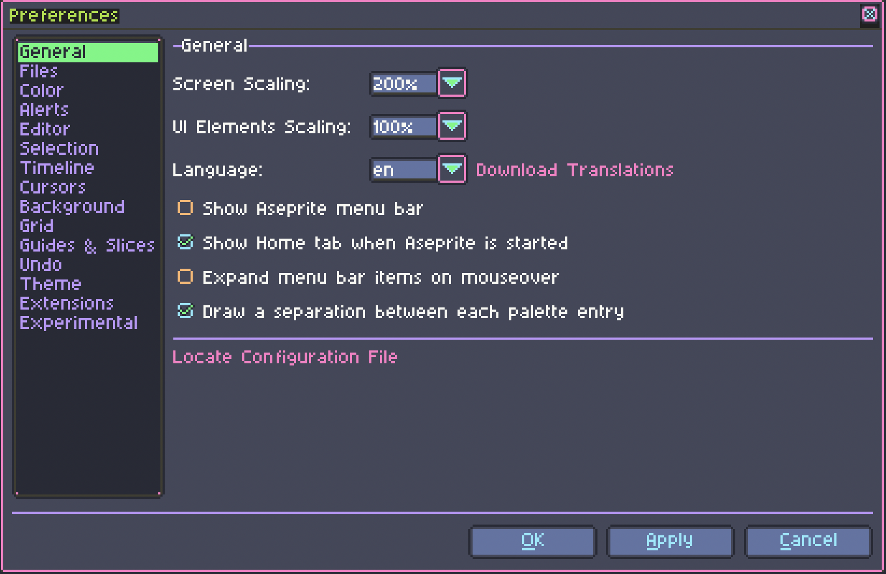
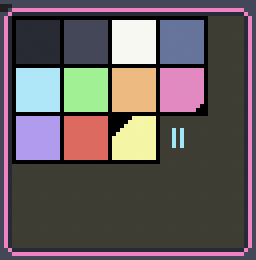

# Dracula for [Aseprite](https://www.aseprite.org/)

> A dark theme for [Aseprite](https://www.aseprite.org/).

Also, as a bonus, you get the Dracula colour palette!

## Install

All instructions can be found at [draculatheme.com/aseprite](https://draculatheme.com/aseprite).

## Team

This theme is maintained by the following person(s) and a bunch of [awesome contributors](https://github.com/dracula/aseprite/graphs/contributors).

| [![abbabon/avatar_url]][abbabon] |
|:--------------------------------------:|
|              [abbabon]              |

[abbabon]: https://github.com/abbabon
[abbabon/avatar_url]: https://avatars1.githubusercontent.com/u/1280330?s=70

## Help
Not all of the sheet was edited while making this theme, as I focused more on colour scheme. Found anything which doesn't fit into the theme? Good suggestion for a font? Open an [Issue on GitHub](https://github.com/abbabon/aseprite-dracula-theme/issues/new "New Issue &#183; abbabon/aseprite-dracula-theme") or message me on [Twitter](https://twitter.com/abbabon).

## License
This theme is based on the default theme of [Aseprite](http://aseprite.org "Aseprite - Animated sprite editor & pixel art tool") by Ilija Melentijevic & David Capello.  
Therefore the [Aseprite Eula](https://github.com/aseprite/aseprite/blob/master/EULA.txt "aseprite/EULA.txt at master &#183; aseprite/aseprite") applies on this project, too.

The Dracula theme is subject to the [MIT License](./LICENSE).
